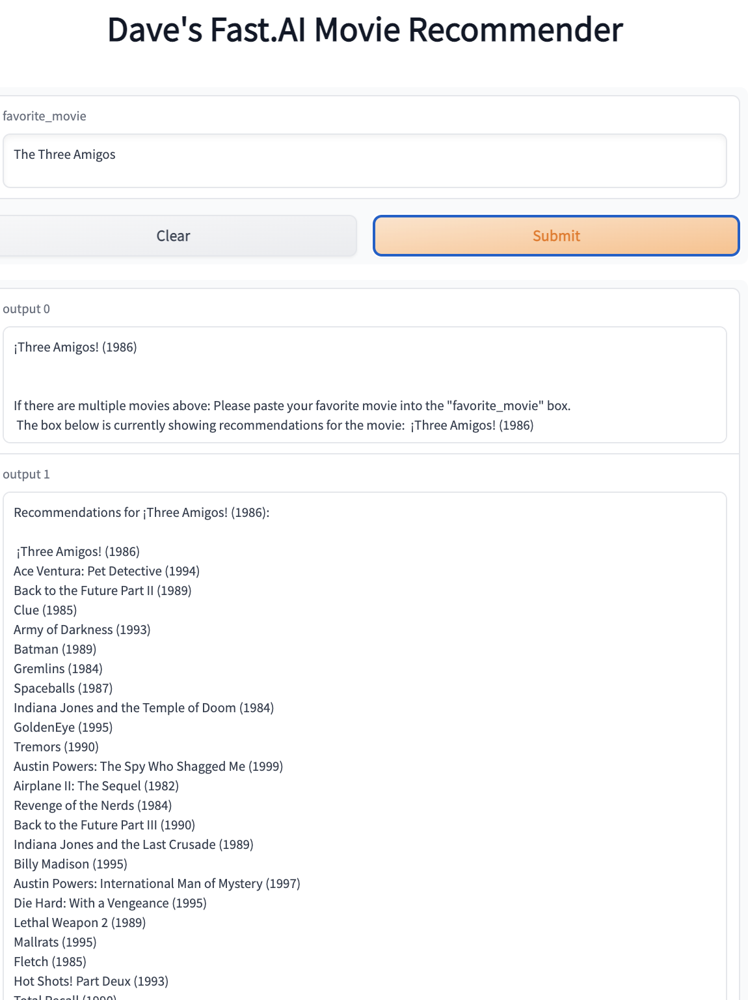

Welcome Dave’s Fastai Movie Recommender
================

<!-- WARNING: THIS FILE WAS AUTOGENERATED! DO NOT EDIT! -->

This file will become your README and also the index of your
documentation.

## Install

``` sh
pip install movie_recommender
```

## How to use

This lib provides a
[`get_movie_recs`](https://daveramseymusic.github.io/movie-rec/movie_recommender.html#get_movie_recs)
function to get movie recommendations similar to the movie saved in the
`full_title` variable. It also shows how to use gradio to publish a
usable version of the movie_recommender.

# [Click Here](https://daveramseymusic.github.io/movie-rec/movie_recommender.html#actually-try-the-model-here) to Try the Model Out with Your Favorite Movie

> This links to a place in the documentation where you can use the model

### This is what it will look like:



## A Simple example using the [`get_movie_recs`](https://daveramseymusic.github.io/movie-rec/movie_recommender.html#get_movie_recs) function

``` python
get_movie_recs(full_title='Rushmore (1998)',learn=learn, df_titles=df_titles)
```

    ['Rushmore (1998)',
     'Being John Malkovich (1999)',
     'Royal Tenenbaums, The (2001)',
     'Punch-Drunk Love (2002)',
     'Crimes and Misdemeanors (1989)',
     'Heavenly Creatures (1994)',
     'Blue Ruin (2013)',
     'Fargo (1996)',
     'Dr. Strangelove or: How I Learned to Stop Worrying and Love the Bomb (1964)',
     'Rififi (Du rififi chez les hommes) (1955)',
     'Lost in Translation (2003)',
     'Great Dictator, The (1940)',
     'Eternal Sunshine of the Spotless Mind (2004)',
     'Hearts of Darkness: A Filmmakers Apocalypse (1991)',
     'Fireworks (Hana-bi) (1997)',
     'Adaptation (2002)',
     'Bob Roberts (1992)',
     'Cabinet of Dr. Caligari, The (Cabinet des Dr. Caligari., Das) (1920)',
     'Ghost World (2001)',
     'Brazil (1985)',
     'Baraka (1992)',
     'City of Lost Children, The (Cité des enfants perdus, La) (1995)',
     'Three Colors: Blue (Trois couleurs: Bleu) (1993)',
     'Player, The (1992)',
     'There Will Be Blood (2007)',
     'Ran (1985)',
     'Sexy Beast (2000)',
     'Nebraska (2013)',
     'Delicatessen (1991)',
     'Tale of Two Sisters, A (Janghwa, Hongryeon) (2003)']
